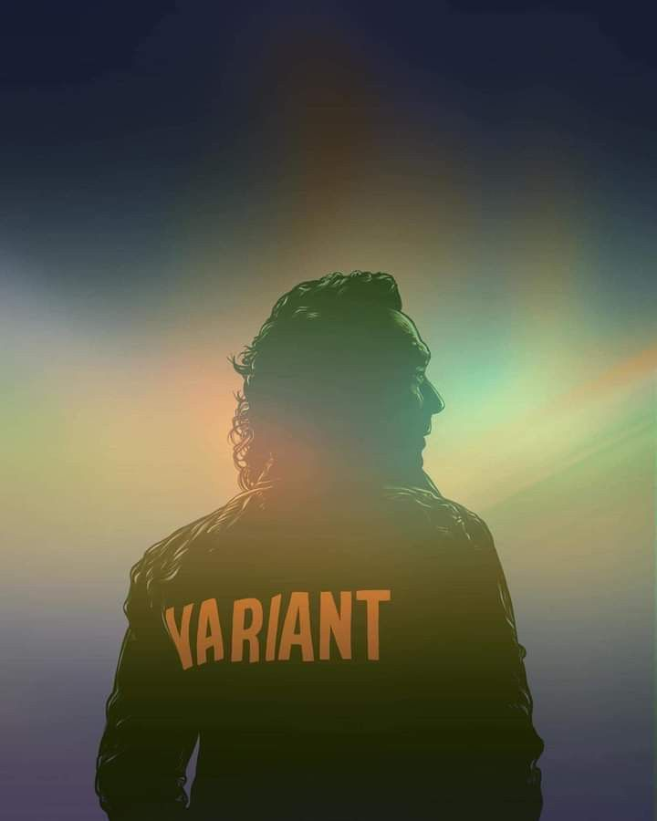

<h1>Hello there reader!🥀</h1>

Well I am burden with the Glorious Purpose 
<i>(Glorious Purpose of changing world)</i>

---

<h2 align="center">About me</h2>

<table>
<tr>
<td valign="top">

Well now I will tell you about myself ok like My name Abhishek and a yeah I am currently studying Data Science but I think we will keep studying for whole life and isn't it beautiful knowing that you will learn new things everyday, till the day you live. 
For me it's so fascinating to be honest.  
I like to play games, listen all type of music, watch movies, series specially those like of superheroes or like fantasy witchers, I love mountains , I love trees ohhh there are so many things that I love , there are so many things that I want to learn and yeah I will learn them don't worry.  
I think most us didn't realise what we can do , I believe we can be anyone like we can be like our favourite comic superhero or you can be Loki(😉).

</td>
<td width="280" align="center">

</td>
</tr>
</table>

---

<table>
<tr>

<td valign="top">

All and all this life is so exciting , technologies is rising like at a exponential rate and I like that , I am so much excited to see what we get in future.  
I want future to look like solar punk, or like steam punk more like a fantasy and I also want it to a cyberpunk also and ohh that gonna be a paradoxical.

</td>
</tr>
</table>

<b>Well my null hypothesis is that the future will be like whatever we dreamed of if we believe in us , in all around you.</b>

---

Also I love talking to people on their ideas like what they want , what they are curious of. I guess we are so lost in showing off to the world that we lost what it like to be a human.

<h1><b>Well I am a PunkRocker! toooo</b></h1>

